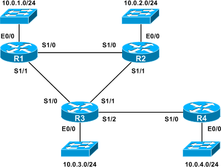
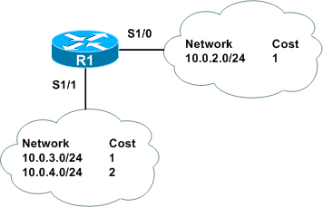
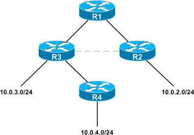
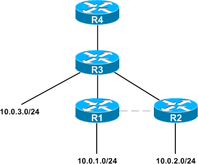

# Tugas Besar 2 IF 3130 Jaringan Komputer
## Distance Vector Simulation
#### Kelompok Pertamax - K03
##### 13515030 - Rizki Elzandy Barik
##### 13515069 - Hisham Lazuardi Yusuf
##### 13515120 - Azis Adi Kuncoro
##

## A. Petunjuk penggunaan program.

Untuk menjalankan program **Distance Vector Simulation** ini cukup ketikkan command `make` pada terminal atau konsol.

## B. Bagaimana anda mensimulasikan sebuah node dalam program anda?
Mula-mula, setiap *node* akan memiliki atribut berupa *distance* dan *nextHop* yang diinisialisasi dengan nilai -1. Kemudian informasi dari tiap *node* yang behubungan disimpan dalam sebuah *adjacency matrix* yang diinisialisasi saat awal program dijalankan. Kemudian *node* yang berhubungan akan memiliki *cell* yang bernilai 1. Jika tidak, maka akan bernilai 0.

Setelah *adjacency matrix* terbentuk, semua nilai disimpan dalam *routing table* yang dimiliki oleh tiap *node* yang disimpan dalam sebuah *array*. *Routing table* akan menyimpan jumlah *node* yang terdapat pada graf dan informasi mengenai jarak	menuju *node* lain terhadap suatu *node* dan *nextHop* yang diperlukan untuk mencapai *node* lain tersebut

## C. Bagaimana proses pengiriman pesan antar node terjadi?
Pada saat pengiriman pesan, program akan melakukan *update* informasi pada *routing table* milik *node* yang dituju. Program hanya melakukan *update* informasi pada *routing table* suatu *node* jika *node* tujuan dapat dicapai atau terhubung secara langsung dari *node* asal menurut routing table *node* tersebut. Program juga hanya mengupdate baris dari *routing table node* tujuan jika jarak pada *node tujuan* menuju *node* ke-i masih -1 (tak terhingga) atau lebih besar dari jarak *node* asal menuju *node* tujuan menurut *routing table node* tujuan ditambah jarak *node* tujuan menuju *node* ke-i.

## D. Pembagian tugas.

1. 13515030 :

2. 13515069 :

3. 13515120 :

## E. Pertanyaan
#### 1. Apakah perbedaan dari *routing protocol distance-vector* dan *link state*? Manakah yang lebih baik untuk digunakan?
Pada *distance-vector protocol* suatu *node* hanya dapat mengetahui informasi mengenai *node* tetangga yang berhubungan langsung dan hanya menyimpan informasi mengenai jarak dan *router nextHop* untuk menuju ke suatu *node* di dalam suatu *Routing Table*. Sedangkan, pada *link-state routing protocol* suatu *node* dapat mengetahui rute yang dapat digunakan untuk mencapai semua *node* di dalam suatu jaringan serta informasi mengenai *node* lainnya dengan proses *Reliable Flooding* dan menyimpan informasi mengenai semua *node* di dalam jaringan dalam bentuk graf. Penentuan jarak optimal dari suatu *node* ke *node* lainnya pada *distance-vector protocol* menggunakan algoritma **Bellmann-Ford**, sedangkan pada *link-state protocol* menggunakan algoritma **Dijkstra**.

Misal ada suatu topologi jaringan seperti gambar dibawah ini :

Jika menggunakan **Distance Vector Protocol** maka informasi mengenai rute terpendek yang diketahui oleh *node* R1 terhadap *node* lain pada jaringan di atas adalah sebagai berikut :

Sedangkan jika menggunakan **Link State Protocol** maka rute terpendek yang diketahui oleh *node* R1 adalah :

Dan untuk *node* R4 adalah sebagai berikut :

Algoritma *routing protocol* yang lebih baik untuk digunakan tergantung dari kebutuhan dan scope jaringan yang tersedia, misalnya untuk jaringan dengan jumlah node yang besar dan mempunyai kecepatan yang cepat menggunakan *link state protocol* lebih baik daripada *distance vector protocol*, sedangkan jika jaringan dengan node yang kecil dan kecepatan tetap maka *distance vector protocol* lebih baik.Tetapi secara keseluruhan **Link State Protocol** lebih baik untuk digunakan. Penjelasan ada di bagian selanjutnya.

#### 2. Pada implementasinya saat ini manakah yang lebih banyak digunakan, *distance-vector* atau *link state*? Kenapa?
*Link state protocol* lebih banyak digunakan pada saat ini karena lebih cepat dalam menghasilkan *path* yang optimal dan lebih efektif dibandingkan dengan *distance-vector protocol* yang rawan terhadap permasalahan *count-to-infinity problem*, di mana *packet* mengalami *routing loop* (*packet* berputar antara router-router antara dan tidak dapat mencapai tujuannya)
